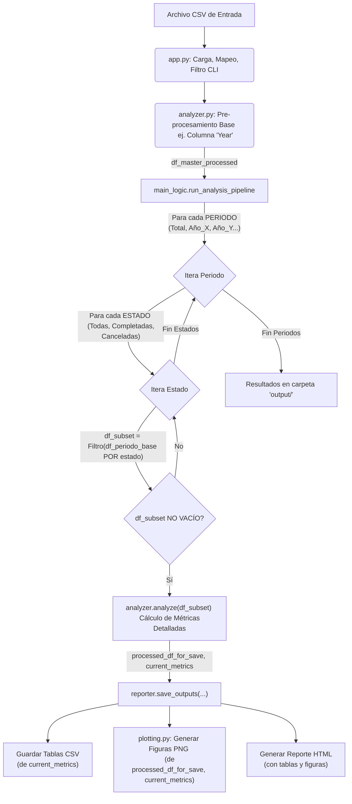

# Proyecto de Análisis de Datos P2P (Versión Profesional) 🚀

Este proyecto proporciona una solución integral para el análisis avanzado de datos de operaciones Peer-to-Peer (P2P), comúnmente exportados desde plataformas de intercambio de criptomonedas como Binance. Utilizando el poder y la eficiencia de la biblioteca **Polars** para el backend de procesamiento de datos, el script principal ingiere un archivo CSV, realiza una limpieza y transformación exhaustiva de los datos, calcula un amplio espectro de métricas financieras y de actividad, genera múltiples tablas de resumen detalladas, crea visualizaciones informativas con `matplotlib` y `seaborn`, y consolida toda esta información en reportes HTML interactivos.

Una característica distintiva es su capacidad para organizar los resultados de forma meticulosa: no solo para el conjunto de datos completo, sino también desglosado por cada año presente en los datos. Además, dentro de cada uno de estos periodos (total y anual), el análisis se segmenta aún más según el estado de la orden —`Completadas`, `Canceladas`, y `Todas`— permitiendo una granularidad excepcional y una comprensión profunda de las dinámicas de las operaciones P2P.

## 📖 Tabla de Contenidos
1.  [🎯 Visión General del Proyecto](#-visión-general-del-proyecto)
2.  [🛠️ Arquitectura del Código Fuente (`src/`)](#️-arquitectura-del-código-fuente-src)
    *   [`app.py`](#apppy)
    *   [`main_logic.py`](#main_logicpy)
    *   [`analyzer.py`](#analyzerpy)
    *   [`reporter.py`](#reporterpy)
    *   [`plotting.py`](#plottingpy)
    *   [`config_loader.py`](#config_loaderpy)
    *   [`utils.py`](#utilspy)
3.  [🌊 Flujo de Procesamiento de Datos Detallado](#-flujo-de-procesamiento-de-datos-detallado)
4.  [⚙️ Configuración del Proyecto (`src/config_loader.py`)](#️-configuración-del-proyecto-srcconfig_loaderpy)
5.  [📊 Columnas Clave y Mapeo](#-columnas-clave-y-mapeo)
6.  [📈 Métricas Calculadas (`src/analyzer.py`)](#-métricas-calculadas-srcanalyzerpy)
7.  [🖼️ Generación de Salidas (`src/reporter.py` y `src/plotting.py`)](#️-generación-de-salidas-srcreporterpy-y-srcplottingpy)
8.  [🚀 Uso Avanzado y Argumentos CLI](#-uso-avanzado-y-argumentos-cli)
9.  [👨‍💻 Guía para Desarrolladores](#-guía-para-desarrolladores)
10. [🔗 Dependencias Clave](#-dependencias-clave)
11. [🔄 Flujo de Procesamiento de Datos (Resumen Gráfico Simplificado)](#-flujo-de-procesamiento-de-datos-resumen-gráfico-simplificado)


## 🎯 Visión General del Proyecto

El objetivo principal de este proyecto es ofrecer a los usuarios una herramienta robusta y flexible para convertir datos crudos de transacciones P2P en información accionable y fácil de interpretar. Está dirigido a traders activos, analistas financieros o cualquier persona que necesite un entendimiento detallado de su historial de operaciones P2P para optimizar estrategias, realizar declaraciones fiscales, o simplemente para llevar un control detallado de su actividad.

**Beneficios Clave:**
*   **Análisis Profundo y Automatizado:** Ahorra horas de procesamiento manual de datos.
*   **Comprensión Granular:** El desglose por año y estado de orden revela patrones que podrían pasar desapercibidos.
*   **Salidas Múltiples y Claras:** Tablas CSV para análisis posterior, gráficos para visualización rápida y reportes HTML para una presentación completa.
*   **Eficiencia con Polars:** Manejo rápido de grandes volúmenes de datos gracias a Polars, un motor de procesamiento de DataFrames escrito en Rust.
*   **Personalización vía CLI:** Adaptabilidad a diferentes necesidades de filtrado y análisis mediante una interfaz de línea de comandos intuitiva.
*   **Resultados Organizados:** Una estructura de directorios clara para los archivos de salida (`output/`), facilitando el acceso y la revisión.

## 🛠️ Arquitectura del Código Fuente (`src/`)

Esta sección describe los módulos principales que componen el proyecto y sus responsabilidades.

*   **`app.py`**:
    *   **Rol:** Punto de entrada principal de la aplicación CLI (Command Line Interface). Es el script que el usuario ejecuta directamente.
    *   **Responsabilidades:**
        *   Utiliza `main_logic.initialize_analysis` para definir y parsear los argumentos proporcionados por el usuario en la línea de comandos.
        *   Carga la configuración base del proyecto mediante `config_loader.load_config`.
        *   Lee el archivo CSV de entrada especificado por el usuario (argumento `--csv`) utilizando Polars, aplicando inferencia de esquema y manejo de valores nulos.
        *   Realiza un mapeo inicial de columnas: renombra las columnas del CSV a los nombres internos estandarizados definidos en `config['column_mapping']`.
        *   Aplica filtros globales al DataFrame cargado, basados en los argumentos opcionales de la CLI (como `--fiat_filter`, `--asset_filter`, `--status_filter`, `--payment_method_filter`).
        *   Realiza una primera pasada de procesamiento llamando a `analyzer.analyze` sobre el DataFrame (ya filtrado por CLI) para generar columnas base necesarias para el desglose (ej. `Year`).
        *   Orquesta el pipeline de análisis principal invocando `main_logic.run_analysis_pipeline`, pasándole el DataFrame pre-procesado, los argumentos CLI, la configuración, etc.

*   **`main_logic.py`**:
    *   **Rol:** Contiene la lógica de orquestación para el parseo de argumentos y el pipeline de análisis segmentado.
    *   **Responsabilidades:**
        *   **`initialize_analysis(cli_args_list=None)`**:
            *   Define todos los argumentos aceptados por la línea de comandos usando el módulo `argparse` (e.g., `--csv`, `--out`, `--fiat_filter`, `--no_annual_breakdown`).
            *   Procesa los argumentos recibidos.
            *   Construye sufijos de nombres de archivo (ej. `_fiat_UYU_asset_USDT`) y sufijos de títulos para los reportes, basados en los filtros CLI activos, para una fácil identificación de las salidas.
            *   Devuelve los argumentos parseados (`args`), el sufijo limpio para nombres de archivo y el sufijo para títulos.
        *   **`run_analysis_pipeline(...)`**:
            *   Recibe el DataFrame maestro ya pre-procesado por `app.py`.
            *   Determina los "periodos" a procesar:
                *   Siempre incluye un periodo "total" que corresponde al DataFrame maestro completo.
                *   Si no se especifica `--no_annual_breakdown` y la columna `Year` está disponible, identifica todos los años únicos en los datos y crea un DataFrame filtrado para cada año, añadiéndolo como un periodo adicional a procesar.
            *   Itera sobre cada "periodo" determinado (ej. "total", "2022", "2023").
            *   Dentro de cada periodo, itera sobre las tres categorías de estado definidas: `"todas"`, `"completadas"`, `"canceladas"`.
            *   Para la combinación actual de `periodo` y `status_category`:
                *   Filtra el DataFrame del periodo base para obtener el subconjunto de datos específico (ej., datos de 2023 que estén "Completed", o todos los datos de "total" que sean "Cancelled" o "System cancelled").
                *   Si el subconjunto resultante está vacío, se omite y se pasa a la siguiente iteración.
                *   Llama a `analyzer.analyze` nuevamente, esta vez sobre este subconjunto específico. Esto recalcula todas las métricas granulares para esa combinación particular de periodo y estado.
                *   Luego, llama a `reporter.save_outputs` para generar y guardar todas las salidas (tablas CSV, figuras PNG, reporte HTML) correspondientes a este subconjunto analizado.

*   **`analyzer.py`**:
    *   **Rol:** Es el corazón del procesamiento de datos y el cálculo de todas las métricas numéricas y estadísticas.
    *   **Responsabilidades (principalmente dentro de la función `analyze`):**
        *   Recibe un DataFrame (que puede ser el global filtrado por CLI, o un subconjunto específico de periodo/estado desde `main_logic.py`), el `col_map` y `sell_config`.
        *   **Transformación y Creación de Columnas Fundamentales:**
            *   **Columnas Numéricas:** Convierte columnas de texto que representan valores monetarios o cantidades (ej. `Price`, `Quantity`, `Total Price`, `Maker Fee`, `Taker Fee`) a tipos numéricos `Float64`. Utiliza `utils.parse_amount` para manejar posibles formatos con comas o diferentes separadores decimales. Si una columna mapeada no existe en el CSV, se crea como una columna de nulos para evitar errores posteriores.
            *   `TotalFee`: Calcula la comisión total sumando `MakerFee_num` y `TakerFee_num` (los nulos se tratan como 0).
            *   **Columnas de Tiempo:**
                *   Asegura la existencia de `Match_time_local` (hora local de la operación). Si no existe o no es de tipo datetime, intenta crearla a partir de `match_time_utc` (la columna de tiempo UTC del CSV). Esta conversión incluye la localización a una zona horaria específica (actualmente 'America/Montevideo').
                *   A partir de `Match_time_local`, deriva:
                    *   `hour_local`: La hora del día (0-23).
                    *   `YearMonthStr`: El año y mes en formato 'YYYY-MM'.
                    *   `Year`: El año como entero.
                *   Maneja robustamente la ausencia de la columna de tiempo original o errores en la conversión.
        *   **Cálculo de un Diccionario de Métricas Agregadas (usando Polars):**
            *   `asset_stats`: Agrupado por `asset_type` y `order_type` (BUY/SELL). Calcula: `operations` (conteo), `quantity` (suma de `Quantity_num`), `total_fiat` (suma de `TotalPrice_num`), `total_fees` (suma de `TotalFee`).
            *   `fiat_stats`: Agrupado por `fiat_type` y `order_type`. Calcula: `operations`, `total_fiat`, `avg_price` (media de `Price_num`), `total_fees`.
            *   `price_stats`: Agrupado por `fiat_type`. Calcula estadísticas descriptivas detalladas para `Price_num`: `avg_price`, `median_price`, `min_price`, `max_price`, `std_price`, `q1_price` (percentil 25), `q3_price` (percentil 75), `iqr_price` (rango intercuartílico), `p1_price` (percentil 1), `p99_price` (percentil 99).
            *   `fees_stats`: Agrupado por `asset_type`. Calcula: `total_fees_collected`, `avg_fee_per_op`, `num_ops_with_fees` (conteo de operaciones con comisión > 0), `max_fee`.
            *   `monthly_fiat`: Agrupa por `YearMonthStr`, `fiat_type`, y `order_type` para sumar `TotalPrice_num`. Luego, pivota la tabla para tener `YearMonthStr` y `fiat_type` como índice, y columnas separadas para los volúmenes de BUY y SELL.
            *   `status_counts`: Conteo de operaciones por cada valor único en la columna `status`.
            *   `side_counts`: Conteo de operaciones por cada valor único en la columna `order_type` (generalmente BUY/SELL).
            *   `hourly_counts`: Conteo de operaciones por `hour_local`, ordenado por hora.
            *   `sales_summary_all_assets_fiat_detailed`: Esta métrica se calcula solo sobre operaciones 'Completed' que además coinciden con la configuración de venta (`sell_config`). Agrupa por `asset_type` (Asset Sold) y `fiat_type` (Fiat Received). Calcula: `Total Asset Sold` (suma de `Quantity_num`), `Total Fiat Received` (suma de `TotalPrice_num`), y `Average Sell Price` (Fiat Recibido / Activo Vendido).
        *   La función `analyze` devuelve una tupla: el DataFrame procesado (con todas las nuevas columnas numéricas y de tiempo) y el diccionario `metrics` que contiene todas las tablas de métricas calculadas.

*   **`reporter.py`**:
    *   **Rol:** Responsable de tomar los datos procesados y las métricas, y generar todas las salidas finales del análisis: tablas CSV, figuras (gráficos) y reportes HTML.
    *   **Responsabilidades (principalmente dentro de la función `save_outputs`):**
        *   **Gestión de Rutas y Directorios:** Crea la estructura de carpetas de salida necesaria (`output/[periodo]/[estado_subdir]/tables/`, `figures/`, `reports/`) si no existe.
        *   **Conversión de Datos Polars a Pandas:** Convierte los DataFrames y Series de Polars (contenidos en `metrics_to_save` y `df_to_plot_from`) a sus equivalentes en Pandas, ya que las bibliotecas de gráficos (`matplotlib`, `seaborn`) y la generación de HTML de Pandas son más directas con objetos Pandas.
        *   **Guardado de Tablas CSV:** Itera sobre cada métrica en `metrics_to_save_pandas`. Guarda cada DataFrame/Serie como un archivo `.csv` en la subcarpeta `tables/` correspondiente. Los nombres de archivo incluyen el sufijo CLI para identificación.
        *   **Generación y Guardado de Figuras:**
            *   Llama a las diversas funciones de `plotting.py` (ej. `plotting.plot_hourly`, `plotting.plot_monthly`, `plotting.plot_price_distribution`, etc.) pasándoles los DataFrames de Pandas apropiados.
            *   Cada función de ploteo guarda su gráfico como un archivo `.png` en la subcarpeta `figures/`.
            *   Mantiene una lista (`figures_for_html`) de las rutas relativas y títulos de las figuras generadas para incluirlas en el reporte HTML.
        *   **Generación de Reportes HTML:**
            *   Carga la plantilla `report_template.html` usando el motor de plantillas Jinja2.
            *   Prepara un "contexto" (un diccionario Python) que se pasará a la plantilla. Este contexto incluye:
                *   Título dinámico del reporte (reflejando periodo, estado y filtros CLI).
                *   Marca de tiempo de generación.
                *   Un resumen de los filtros CLI aplicados.
                *   El periodo analizado (ej. "Año 2023", "Total Consolidado").
                *   La categoría de estado procesada (ej. "Completadas").
                *   Tablas de métricas seleccionadas (según `config['html_report']['include_tables_default']`), convertidas a formato string HTML usando `pandas.DataFrame.to_html()`.
                *   La lista `figures_for_html` para que la plantilla pueda incrustar las imágenes.
            *   Renderiza la plantilla Jinja2 con este contexto, generando el contenido HTML final.
            *   Guarda el string HTML resultante en un archivo `.html` en la subcarpeta `reports/`.

*   **`plotting.py`**:
    *   **Rol:** Módulo dedicado a la creación de todas las visualizaciones gráficas del proyecto.
    *   **Responsabilidades:**
        *   Contiene una serie de funciones, cada una nombrada `plot_*` (ej. `plot_hourly`, `plot_monthly`, `plot_pie`, `plot_price_distribution`, `plot_volume_vs_price_scatter`, `plot_activity_heatmap`).
        *   Cada función es responsable de generar un tipo específico de gráfico.
        *   Toma como entrada un DataFrame de Pandas (preparado y filtrado en `reporter.py`), el directorio de salida para las figuras, y sufijos para el título y el nombre del archivo.
        *   Utiliza `matplotlib.pyplot` y `seaborn` para construir los gráficos.
        *   Se encarga de la configuración estética (colores, estilos), etiquetas de ejes, títulos de gráficos, leyendas, y el guardado final del gráfico como un archivo PNG en la ruta especificada.
        *   Maneja casos donde los datos de entrada podrían ser insuficientes para generar un gráfico, emitiendo logs y retornando `None` o una lista vacía de rutas.
        *   (Ver sección "📊 Figuras Generadas" para una lista detallada).

*   **`config_loader.py`**:
    *   **Rol:** Centraliza la configuración del proyecto.
    *   **Responsabilidades:**
        *   Define una constante `DEFAULT_CONFIG`, que es un diccionario Python sirviendo como la configuración por defecto para la aplicación. Esta configuración incluye:
            *   `column_mapping`: Un diccionario crucial que mapea los nombres de las columnas esperados/deseados por el script (claves) a los nombres de columna tal como podrían aparecer en el archivo CSV de entrada (valores). Esto permite flexibilidad si diferentes usuarios tienen CSVs con nombres de columna ligeramente distintos.
            *   `sell_operation`: Especifica qué columna (`indicator_column`) y qué valor (`indicator_value`) en esa columna identifican una operación de venta. Usado para el `sales_summary_all_assets_fiat_detailed`.
            *   `reference_fiat_for_sales_summary`: (Actualmente "USD") Un fiat de referencia que podría usarse para normalizar o presentar resúmenes de ventas (aunque su uso prominente no está implementado más allá de la configuración).
            *   `html_report`: Define qué tablas de métricas (`include_tables_default`) y qué tipos de figuras (`include_figures_default`, aunque esta última parte parece no estar completamente implementada para seleccionar figuras específicas por defecto) se deben incluir en los reportes HTML generados.
        *   Proporciona la función `load_config()`, que actualmente solo devuelve una copia del `DEFAULT_CONFIG`. En futuras versiones, esta función podría ser extendida para cargar configuraciones desde archivos externos (ej. YAML, JSON), permitiendo una personalización más fácil sin modificar el código fuente.

*   **`utils.py`**:
    *   **Rol:** Colección de funciones de utilidad pequeñas y genéricas usadas en otras partes del proyecto.
    *   **Responsabilidades:**
        *   **`parse_amount(val)`**: Una función clave para la limpieza de datos. Toma un valor que puede ser un string (potencialmente con comas como separadores de miles o diferentes caracteres decimales), un entero o un flotante. Intenta convertirlo a un tipo `float` estándar de Python. Si la conversión falla (ej. el string no es un número válido), devuelve `None` en lugar de causar un error, permitiendo un procesamiento más robusto.

## 🌊 Flujo de Procesamiento de Datos Detallado

El flujo de datos y procesamiento en el proyecto se puede resumir en las siguientes etapas principales:

1.  **Inicio y Configuración (`app.py` & `main_logic.py`)**:
    *   El usuario ejecuta `python src/app.py` con los argumentos CLI necesarios (mínimo `--csv`).
    *   `main_logic.initialize_analysis` parsea estos argumentos y genera sufijos para nombres de archivo/títulos.
    *   `app.py` carga la configuración por defecto desde `config_loader.load_config()`.

2.  **Carga y Mapeo Inicial de Datos (`app.py`)**:
    *   El archivo CSV especificado es leído por Polars (`pl.read_csv`). Se especifican tipos para columnas de números de orden para asegurar que se lean como strings.
    *   Las columnas del DataFrame cargado se renombran según el `column_mapping` de la configuración. Esto estandariza los nombres de las columnas para el resto del script.

3.  **Filtrado Global por CLI (`app.py`)**:
    *   El DataFrame se clona y se aplican los filtros opcionales de la línea de comandos:
        *   `--fiat_filter`: Filtra por moneda(s) fiat.
        *   `--asset_filter`: Filtra por tipo(s) de activo.
        *   `--status_filter`: Filtra por estado(s) de orden.
        *   `--payment_method_filter`: Filtra por método(s) de pago.
    *   Si el DataFrame queda vacío después de estos filtros, el script termina.

4.  **Pre-procesamiento Base (`app.py` -> `analyzer.analyze`)**:
    *   Se llama a `analyzer.analyze` una vez con el DataFrame filtrado por CLI. El propósito principal de esta llamada inicial es asegurar que las columnas necesarias para el desglose posterior (especialmente `Year` derivada de `Match_time_local`) se generen en el `df_master_processed`. Las métricas calculadas en esta etapa (variable `_` en `df_master_processed, _ = analyze(...)`) usualmente no se usan directamente, ya que el análisis detallado ocurre después para cada subconjunto.
    *   Si `df_master_processed` está vacío (ej., si todas las fechas son inválidas), el script termina.

5.  **Pipeline de Análisis Segmentado (`app.py` -> `main_logic.run_analysis_pipeline`)**:
    *   `main_logic.run_analysis_pipeline` toma el control.
    *   **Determinación de Periodos**:
        *   Se crea un periodo "total" usando `df_master_processed`.
        *   Si `--no_annual_breakdown` no está activo y la columna `Year` existe (y no es todo nulos), se extraen los años únicos y se crean DataFrames filtrados para cada año, añadiéndolos a la lista de periodos a procesar.
    *   **Bucle Principal (Iteración por Periodo y Estado)**:
        *   Se itera sobre cada `period_label` (ej. "total", "2022", "2023", ...).
        *   Dentro de cada periodo, se itera sobre `status_category` ("todas", "completadas", "canceladas").
        *   **Filtrado Específico**: Se crea `df_subset_for_status` filtrando `df_period_base` (el DataFrame del periodo actual) según la `status_category`:
            *   "todas": Se clona `df_period_base`.
            *   "completadas": Se filtra por `status == 'Completed'`.
            *   "canceladas": Se filtra por `status` siendo 'Cancelled' o 'System cancelled'.
        *   Si `df_subset_for_status` está vacío, se omite esa combinación y se pasa a la siguiente iteración.
        *   **Análisis Detallado del Subconjunto (`main_logic.py` -> `analyzer.analyze`)**:
            *   Se llama a `analyzer.analyze` con `df_subset_for_status`. Esta es la llamada crucial donde se calculan todas las métricas detalladas (`current_metrics`) para la combinación específica de periodo y estado. El `processed_df_for_save` devuelto contiene el subconjunto con todas las columnas transformadas (numéricas, de tiempo).
        *   **Generación de Salidas (`main_logic.py` -> `reporter.save_outputs`)**:
            *   Se llama a `reporter.save_outputs` con `processed_df_for_save`, `current_metrics`, etiquetas de periodo y estado, configuración, argumentos CLI, etc.
            *   `reporter.save_outputs` se encarga de:
                *   Crear la estructura de carpetas (`output/[period_label]/[status_category]/[tables|figures|reports]`).
                *   Convertir DataFrames y Series de Polars a Pandas para la generación de gráficos y algunas tablas HTML.
                *   Guardar las tablas de `current_metrics` en archivos CSV en la carpeta `tables/`.
                *   Llamar a las funciones correspondientes en `plotting.py` para generar los archivos PNG de los gráficos, usando `processed_df_for_save` y las métricas relevantes.
                *   Generar y guardar el reporte HTML, incluyendo las tablas de métricas y las figuras generadas, en la carpeta `reports/`.

6.  **Finalización (`app.py`)**:
    *   Una vez que todos los bucles de `run_analysis_pipeline` han terminado, `app.py` imprime un mensaje de finalización indicando la ruta a la carpeta de salida principal.

## ⚙️ Configuración del Proyecto (`src/config_loader.py`)

La configuración del proyecto se gestiona centralmente en `src/config_loader.py` a través de un diccionario Python llamado `DEFAULT_CONFIG`. Esto permite un fácil ajuste de ciertos comportamientos del script sin modificar la lógica principal.

```python
DEFAULT_CONFIG = {
    'column_mapping': {
        'order_number': "Order Number",       # Nombre de columna en CSV para el número de orden
        'order_type': "Order Type",         # Nombre para tipo de orden (BUY/SELL)
        'asset_type': "Asset Type",         # Nombre para tipo de activo (ej. USDT, BTC)
        'fiat_type': "Fiat Type",          # Nombre para moneda fiduciaria (ej. USD, UYU)
        'total_price': "Total Price",        # Nombre para el monto total en fiat de la operación
        'price': "Price",                # Nombre para el precio unitario
        'quantity': "Quantity",            # Nombre para la cantidad de activo
        'status': "Status",              # Nombre para el estado de la orden
        'match_time_utc': "Match time(UTC)", # Nombre para la fecha/hora de la operación en UTC
        'payment_method': "Payment Method",   # Nombre para el método de pago
        'maker_fee': "Maker Fee",          # Nombre para la comisión del maker
        'taker_fee': "Taker Fee",          # Nombre para la comisión del taker
        'sale_value_reference_fiat': None # (Opcional, no usado activamente) Fiat para referenciar valor de venta
    },
    'sell_operation': {
        'indicator_column': "order_type",   # Columna interna usada para identificar ventas
        'indicator_value': "SELL"           # Valor en 'indicator_column' que significa venta
    },
    'reference_fiat_for_sales_summary': "USD", # Fiat de referencia para resúmenes (uso limitado actual)
    'html_report': {
        'include_tables_default': ["asset_stats", "fiat_stats"], # Claves de métricas a incluir como tablas en HTML
        'include_figures_default': ["hourly_operations"]       # (Placeholder) Idea futura: seleccionar figuras por defecto
    }
}
```

**Secciones de `DEFAULT_CONFIG`:**

*   **`column_mapping`**:
    *   **Propósito:** Permite al script adaptarse a archivos CSV que puedan tener nombres de columna ligeramente diferentes a los esperados internamente.
    *   **Uso:** Las claves del diccionario son los nombres *internos* que el script usa consistentemente (ej. `order_type`). Los valores son los nombres de columna *esperados en el archivo CSV de entrada*. Durante la carga inicial en `app.py`, las columnas del CSV se renombran a estos nombres internos.
    *   **Personalización:** Si tu CSV usa "Tipo de Orden" en lugar de "Order Type", simplemente cambiarías `'order_type': "Order Type"` por `'order_type': "Tipo de Orden"`.

*   **`sell_operation`**:
    *   **Propósito:** Define cómo el script identifica las operaciones de venta, necesario para métricas como `sales_summary_all_assets_fiat_detailed`.
    *   **Uso:**
        *   `indicator_column`: Especifica el nombre *interno* de la columna que contiene la información de si una orden es compra o venta (por defecto, `'order_type'`, que viene del mapeo).
        *   `indicator_value`: Especifica el valor dentro de `indicator_column` que identifica una operación de venta (por defecto, `"SELL"`).
    *   **Personalización:** Si tus datos marcan las ventas con "Venta" en la columna "TipoOperacion" (y has mapeado "TipoOperacion" a `order_type`), cambiarías `indicator_value` a `"Venta"`.

*   **`reference_fiat_for_sales_summary`**:
    *   **Propósito:** Originalmente pensado para normalizar o presentar resúmenes de ventas en un fiat de referencia común.
    *   **Uso Actual:** Limitado. El script actualmente no realiza conversiones de moneda basadas en este valor. Es más un placeholder para funcionalidad futura.

*   **`html_report`**:
    *   **Propósito:** Controla qué contenido se incluye por defecto en los reportes HTML generados.
    *   **Uso:**
        *   `include_tables_default`: Una lista de strings. Cada string es una clave del diccionario de métricas devuelto por `analyzer.analyze` (ej. `"asset_stats"`, `"fiat_stats"`). Solo estas tablas se incluirán en el reporte HTML.
        *   `include_figures_default`: Pensado para una funcionalidad similar para las figuras, pero actualmente las figuras se incluyen basadas en su generación exitosa más que en una lista explícita aquí.
    *   **Personalización:** Para añadir más tablas al HTML (ej. `price_stats`), simplemente añade su clave a la lista `include_tables_default`.

La función `load_config()` actualmente solo devuelve una copia de este `DEFAULT_CONFIG`. Para una personalización más avanzada sin modificar el código, esta función podría extenderse para leer un archivo de configuración externo (ej. `config.yaml`).

## 📊 Columnas Clave y Mapeo

La flexibilidad del script para manejar diferentes formatos de CSV se basa en gran medida en el `column_mapping` definido en la configuración. El script opera internamente con un conjunto estandarizado de nombres de columna (las claves en `column_mapping`).

**Proceso de Mapeo:**
1.  Al cargar el CSV, `app.py` lee los nombres de las columnas tal como están en el archivo.
2.  Luego, compara estos nombres con los *valores* en `DEFAULT_CONFIG['column_mapping']`.
3.  Si encuentra una coincidencia, renombra la columna del DataFrame al *nombre interno* (la clave correspondiente en `column_mapping`).
    *   Ejemplo: Si el CSV tiene una columna "Número de Orden" y `column_mapping` tiene `'order_number': "Order Number"`, la columna se renombrará internamente a `order_number`.

**Nombres Internos Principales y su Significado (post-mapeo y procesamiento en `analyzer.py`):**

*   `order_number`: Identificador único de la orden.
*   `order_type`: Tipo de orden (ej. "BUY", "SELL").
*   `asset_type`: Tipo de activo transaccionado (ej. "USDT", "BTC").
*   `fiat_type`: Moneda fiduciaria usada (ej. "USD", "UYU").
*   `total_price`: Valor total de la operación en la moneda fiat (numérico). Originalmente del CSV, luego `TotalPrice_num`.
*   `price`: Precio unitario del activo en la moneda fiat (numérico). Originalmente del CSV, luego `Price_num`.
*   `quantity`: Cantidad del activo transaccionado (numérico). Originalmente del CSV, luego `Quantity_num`.
*   `status`: Estado de la orden (ej. "Completed", "Cancelled", "System cancelled").
*   `match_time_utc`: Fecha y hora de la operación en UTC (del CSV).
*   `payment_method`: Método de pago usado.
*   `maker_fee`: Comisión del maker (numérico). Originalmente del CSV, luego `MakerFee_num`.
*   `taker_fee`: Comisión del taker (numérico). Originalmente del CSV, luego `TakerFee_num`.
*   `Quantity_num`, `MakerFee_num`, `TakerFee_num`, `Price_num`, `TotalPrice_num`: Columnas numéricas (Float64) creadas/validadas en `analyzer.py` a partir de sus contrapartes originales del CSV, después de aplicar `utils.parse_amount`.
*   `TotalFee`: Suma de `MakerFee_num` y `TakerFee_num`.
*   `Match_time_utc_dt`: Columna `match_time_utc` convertida a tipo datetime de Polars, con zona horaria UTC.
*   `Match_time_local`: Fecha y hora de la operación convertida a la zona horaria local (America/Montevideo). Tipo datetime de Polars.
*   `hour_local`: Hora del día (0-23) extraída de `Match_time_local`.
*   `YearMonthStr`: Año y mes (ej. "2023-04") extraído de `Match_time_local`.
*   `Year`: Año (ej. 2023) extraído de `Match_time_local`.

Es crucial que el `column_mapping` en la configuración refleje correctamente los nombres de las columnas en el archivo CSV de entrada para que el script funcione adecuadamente. Si una columna mapeada no se encuentra en el CSV, `analyzer.py` intentará crearla con valores nulos para evitar que el script falle, pero las métricas dependientes de esa columna estarán vacías o incompletas.

## 📈 Métricas Calculadas (`src/analyzer.py`)

La función `analyze` en `src/analyzer.py` es responsable de calcular un conjunto diverso de métricas. Estas métricas se devuelven como un diccionario donde las claves son los nombres de las métricas y los valores son DataFrames o Series de Polars.

A continuación se detallan las principales métricas generadas:

1.  **`asset_stats`** (DataFrame):
    *   **Agrupación:** `asset_type`, `order_type`.
    *   **Cálculos:**
        *   `operations`: Número total de operaciones.
        *   `quantity`: Suma total de `Quantity_num` (volumen del activo).
        *   `total_fiat`: Suma total de `TotalPrice_num` (volumen en fiat).
        *   `total_fees`: Suma total de `TotalFee`.
    *   **Ordenado por:** `total_fiat` (descendente).

2.  **`fiat_stats`** (DataFrame):
    *   **Agrupación:** `fiat_type`, `order_type`.
    *   **Cálculos:**
        *   `operations`: Número total de operaciones.
        *   `total_fiat`: Suma total de `TotalPrice_num`.
        *   `avg_price`: Precio promedio (`Price_num`).
        *   `total_fees`: Suma total de `TotalFee`.
    *   **Ordenado por:** `total_fiat` (descendente).

3.  **`price_stats`** (DataFrame):
    *   **Agrupación:** `fiat_type`.
    *   **Cálculos (sobre `Price_num`):**
        *   `avg_price`: Media.
        *   `median_price`: Mediana.
        *   `min_price`: Mínimo.
        *   `max_price`: Máximo.
        *   `std_price`: Desviación estándar.
        *   `q1_price`: Primer cuartil (Percentil 25).
        *   `q3_price`: Tercer cuartil (Percentil 75).
        *   `iqr_price`: Rango Intercuartílico (Q3 - Q1).
        *   `p1_price`: Percentil 1.
        *   `p99_price`: Percentil 99.

4.  **`fees_stats`** (DataFrame):
    *   **Agrupación:** `asset_type`.
    *   **Cálculos (sobre `TotalFee`):**
        *   `total_fees_collected`: Suma total de comisiones.
        *   `avg_fee_per_op`: Comisión promedio por operación.
        *   `num_ops_with_fees`: Número de operaciones que tuvieron alguna comisión (>0).
        *   `max_fee`: Comisión máxima registrada para ese activo.
    *   **Ordenado por:** `total_fees_collected` (descendente).

5.  **`monthly_fiat`** (DataFrame):
    *   **Agrupación Inicial:** `YearMonthStr`, `fiat_type`, `order_type`.
    *   **Cálculo:** Suma de `TotalPrice_num` (volumen en fiat).
    *   **Transformación:** Se pivota la tabla para que `YearMonthStr` y `fiat_type` sean el índice, y haya columnas separadas para los volúmenes de "BUY" y "SELL" (u otros `order_type` presentes). Los valores nulos (meses/fiats sin un tipo de orden) se rellenan con 0.

6.  **`status_counts`** (Series o DataFrame de una columna):
    *   **Cálculo:** Conteo de ocurrencias de cada valor único en la columna `status`.

7.  **`side_counts`** (Series o DataFrame de una columna):
    *   **Cálculo:** Conteo de ocurrencias de cada valor único en la columna `order_type` (normalmente "BUY" y "SELL").

8.  **`hourly_counts`** (DataFrame):
    *   **Cálculo:** Conteo de ocurrencias de cada valor en la columna `hour_local`.
    *   **Ordenado por:** `hour_local` (ascendente).

9.  **`sales_summary_all_assets_fiat_detailed`** (DataFrame):
    *   **Condición:** Solo se calcula sobre operaciones con `status == 'Completed'` y que coincidan con la definición de venta en `config['sell_operation']` (ej. `order_type == 'SELL'`).
    *   **Agrupación:** `asset_type` (Asset Sold), `fiat_type` (Fiat Received).
    *   **Cálculos:**
        *   `Total Asset Sold`: Suma de `Quantity_num`.
        *   `Total Fiat Received`: Suma de `TotalPrice_num`.
        *   `Average Sell Price (in Fiat Received)`: `Total Fiat Received` / `Total Asset Sold`.
    *   **Nota:** Si no hay operaciones de venta completadas, esta métrica será un DataFrame vacío.

Todas estas métricas se calculan para cada subconjunto de datos (combinación de periodo y estado) procesado por `main_logic.run_analysis_pipeline`.

## 🖼️ Generación de Salidas (`src/reporter.py` y `src/plotting.py`)

El módulo `reporter.py` orquesta la creación de todos los archivos de salida, utilizando `plotting.py` para la generación de los gráficos.

**1. Tablas (`.csv`)**
   *   Ubicación: `output/[periodo]/[estado_subdir]/tables/`
   *   Contenido: Todas las métricas calculadas por `analyzer.py` (descritas en la sección anterior) se guardan como archivos CSV individuales.
   *   Nombrado: `[nombre_metrica][sufijo_cli].csv` (ej. `asset_stats_general.csv`, `price_stats_fiat_UYU.csv`).

**2. Figuras (`.png`)**
   *   Ubicación: `output/[periodo]/[estado_subdir]/figures/`
   *   Generadas por: Funciones en `plotting.py`.
   *   Los gráficos se generan principalmente a partir de los DataFrames de Pandas (convertidos desde Polars en `reporter.py`).
   *   Principales gráficos generados (dependiendo de los datos y la categoría):
        *   **`plot_hourly`**: Gráfico de barras mostrando la cantidad de operaciones por cada hora del día (0-23).
            *   Entrada: Métrica `hourly_counts`.
            *   Nombre archivo: `hourly_counts[sufijo_cli].png`.
        *   **`plot_monthly`**: Gráfico de líneas mostrando el volumen total de fiat (separado por BUY/SELL si aplica) a lo largo de los meses (`YearMonthStr`). Se genera un gráfico por cada `fiat_type` principal.
            *   Entrada: Métrica `monthly_fiat`.
            *   Nombre archivo: `monthly_fiat_volume_[fiat]_[sufijo_cli].png`.
        *   **`plot_pie` (para `side_counts`)**: Gráfico de torta mostrando la distribución de tipos de orden (BUY vs. SELL).
            *   Entrada: Métrica `side_counts`.
            *   Nombre archivo: `buy_sell_distribution[sufijo_cli].png`.
        *   **`plot_pie` (para `status_counts`)**: Gráfico de torta mostrando la distribución de estados de orden.
            *   Entrada: Métrica `status_counts`.
            *   Nombre archivo: `order_status_distribution[sufijo_cli].png`.
        *   **`plot_price_distribution`** (Solo para datos "Completed"): Histograma y boxplot combinados mostrando la distribución de precios (`Price_num`) para pares específicos de `asset_type`/`fiat_type` (actualmente hardcodeado para USDT/USD y USDT/UYU en `reporter.py`), diferenciado por `order_type`.
            *   Entrada: `df_completed_for_plots_pandas` (DataFrame de operaciones completadas).
            *   Nombre archivo: `price_distribution_[asset]_[fiat][sufijo_cli].png`.
        *   **`plot_volume_vs_price_scatter`** (Solo para datos "Completed"): Gráfico de dispersión de volumen (`Quantity_num`) vs. precio (`Price_num`) para pares específicos de `asset_type`/`fiat_type` (actualmente hardcodeado para USDT/USD y USDT/UYU). El tamaño de los puntos es proporcional al `TotalPrice_num`. Diferenciado por `order_type`.
            *   Entrada: `df_completed_for_plots_pandas`.
            *   Nombre archivo: `volume_vs_price_scatter_[asset]_[fiat][sufijo_cli].png`.
        *   **`plot_activity_heatmap`**: Heatmap mostrando la concentración de operaciones por día de la semana y hora del día.
            *   Entrada: `df_to_plot_from_pandas` (el DataFrame principal de la sección actual, puede ser "todas", "completadas" o "canceladas").
            *   Nombre archivo: `activity_heatmap[sufijo_cli].png`.
        *   (Otras funciones de ploteo como `plot_price_over_time`, `plot_volume_over_time`, `plot_price_vs_payment_method` están definidas en `plotting.py` pero podrían no estar activamente llamadas o ser tan prominentes en `reporter.py` como las listadas arriba, o se llaman para pares específicos de forma similar a `plot_price_distribution`).

**3. Reportes (`.html`)**
   *   Ubicación: `output/[periodo]/[estado_subdir]/reports/`
   *   Contenido: Un reporte HTML individual para cada combinación de periodo y estado.
   *   Generación: Usa Jinja2 y la plantilla `templates/report_template.html`.
   *   El reporte incluye:
        *   Título dinámico.
        *   Fecha y hora de generación.
        *   Resumen de los filtros CLI aplicados.
        *   Periodo y categoría de estado del reporte.
        *   Tablas HTML seleccionadas (desde `config['html_report']['include_tables_default']`).
        *   Todas las figuras PNG generadas para esa sección, incrustadas en la página.
   *   Nombrado: `p2p_sales_report[sufijo_cli].html`.

## 🚀 Uso Avanzado y Argumentos CLI

El script se controla mediante argumentos en la línea de comandos.

```bash
python src/app.py --csv RUTA_AL_CSV [OPCIONES...]
```

**Argumentos Principales:**

*   `--csv RUTA_CSV` (**Requerido**): Especifica la ruta al archivo CSV que contiene los datos de las operaciones P2P.
*   `--out CARPETA_SALIDA`: (Opcional) Define la carpeta base donde se guardarán todos los resultados. Por defecto es `output/`.
*   `--no_annual_breakdown`: (Opcional) Si se incluye este flag, el script **no** realizará el desglose por años individuales. Solo procesará el conjunto de datos "total" (después de aplicar los filtros CLI).

**Argumentos de Filtrado (Opcionales):**

Estos filtros se aplican al conjunto de datos **antes** de cualquier desglose por periodo (total/anual) y estado (todas/completadas/canceladas).

*   `--fiat_filter MONEDA1 [MONEDA2 ...]`
    *   Filtra las operaciones para incluir solo aquellas donde la moneda fiat (`fiat_type`) coincida con una o más de las especificadas.
    *   Ejemplo: `--fiat_filter UYU USD` (sensible a mayúsculas/minúsculas según los datos, aunque el script intenta normalizar a mayúsculas para el filtrado).
*   `--asset_filter ACTIVO1 [ACTIVO2 ...]`
    *   Filtra las operaciones para incluir solo aquellas donde el tipo de activo (`asset_type`) coincida con uno o más de los especificados.
    *   Ejemplo: `--asset_filter USDT BTC`
*   `--status_filter ESTADO1 [ESTADO2 ...]`
    *   Filtra las operaciones para incluir solo aquellas cuyo estado (`status`) coincida con uno o más de los especificados.
    *   **Importante:** Este filtro afecta al conjunto de datos *antes* de la segmentación interna por `completadas`/`canceladas`/`todas`.
        *   Si, por ejemplo, usas `--status_filter Cancelled "System cancelled"`, entonces la carpeta `output/[periodo]/completadas/` probablemente estará vacía, y las carpetas `canceladas/` y `todas/` contendrán solo las operaciones canceladas.
        *   Si no se especifica este filtro CLI, la segmentación interna (`completadas`, `canceladas`, `todas`) opera sobre todos los estados presentes después de otros filtros CLI. Para un análisis que considere todos los estados originales en sus respectivas categorías, generalmente es mejor **no** usar este filtro CLI.
*   `--payment_method_filter METODO1 ["METODO CON ESPACIOS" ...]`
    *   Filtra las operaciones para incluir solo aquellas donde el método de pago (`payment_method`) coincida con uno o más de los especificados. Si un método de pago tiene espacios, debe ir entre comillas.
    *   Ejemplo: `--payment_method_filter BROU "Prex ARS"`

**Impacto de los Filtros en los Nombres de Archivo:**
Los filtros CLI aplicados se reflejan en los nombres de los archivos de salida (tablas y figuras) y en los títulos de los reportes HTML, facilitando la identificación del conjunto de datos que representan. Por ejemplo, si se usa `--fiat_filter UYU --asset_filter USDT`, un archivo de estadísticas de activos podría llamarse `asset_stats_fiat_UYU_asset_USDT.csv`. Si no se aplican filtros, se usa el sufijo `_general`.

**Ejemplos Combinados:**

*   Analizar solo operaciones en UYU para el activo USDT, para el año 2023, y guardar en `resultados_especificos`:
    ```bash
    # (El filtrado de año se hace si --no_annual_breakdown no está presente y 2023 existe en los datos)
    python src/app.py --csv data/p2p.csv --fiat_filter UYU --asset_filter USDT --out resultados_especificos
    ```

*   Analizar solo operaciones "Completed" y "Cancelled", sin desglose anual:
    ```bash
    python src/app.py --csv data/p2p.csv --status_filter Completed Cancelled --no_annual_breakdown
    ```
    *(Recuerda la nota sobre `--status_filter` y la segmentación interna).*


## 👨‍💻 Guía para Desarrolladores

Esta sección ofrece pautas para aquellos que deseen modificar o extender la funcionalidad del proyecto.

**1. Entendiendo el Flujo:**
   *   Revisa cuidadosamente las secciones "Arquitectura del Código Fuente" y "Flujo de Procesamiento de Datos Detallado" de este README.
   *   Sigue el flujo de ejecución desde `app.py` -> `main_logic.py` -> `analyzer.py` -> `reporter.py` -> `plotting.py`.

**2. Añadir Nuevas Métricas:**
   *   **Ubicación:** Principalmente en `src/analyzer.py`, dentro de la función `analyze`.
   *   **Pasos:**
        1.  Asegúrate de que las columnas de Polars necesarias para tu nueva métrica existan y estén correctamente procesadas (ej. convertidas a numéricas, fechas a datetime). Realiza estas transformaciones al principio de la función `analyze` si es necesario.
        2.  Escribe la lógica de agregación usando las funciones de Polars (ej. `group_by()`, `agg()`, `sum()`, `mean()`, `filter()`, `with_columns()`, etc.).
        3.  Asigna el resultado (un DataFrame o Serie de Polars) a una nueva clave en el diccionario `metrics`.
            ```python
            # En analyzer.py, dentro de analyze()
            # Ejemplo: Nueva métrica de conteo por método de pago
            if payment_method_col in df_processed.columns:
                metrics['payment_method_counts'] = df_processed[payment_method_col].value_counts()
            else:
                metrics['payment_method_counts'] = pl.Series(dtype=pl.datatypes.UInt32).to_frame() # Devolver vacío si no existe
            ```
        4.  **Opcional:** Si quieres que esta nueva tabla aparezca en el reporte HTML por defecto, añade su clave a la lista `include_tables_default` en `DEFAULT_CONFIG` dentro de `src/config_loader.py`.
            ```python
            # En config_loader.py
            'html_report': {
                'include_tables_default': ["asset_stats", "fiat_stats", "payment_method_counts"], # Añadida nueva métrica
                # ...
            }
            ```
        5.  `reporter.py` guardará automáticamente esta nueva métrica como un archivo CSV.

**3. Añadir Nuevos Gráficos:**
   *   **Paso 1: Crear la Función de Ploteo en `src/plotting.py`**
        1.  Define una nueva función, por ejemplo, `plot_mi_nuevo_grafico(df_pandas: pd.DataFrame, out_dir: str, title_suffix: str = "", file_identifier: str = "_general") -> str | None:`.
        2.  La función debe tomar un DataFrame de Pandas (ya que `reporter.py` convierte los datos de Polars antes de plotear).
        3.  Implementa la lógica de generación del gráfico usando `matplotlib.pyplot` y/o `seaborn`.
        4.  Asegúrate de manejar títulos, etiquetas, leyendas de forma dinámica usando `title_suffix`.
        5.  Construye el `file_path` completo usando `os.path.join(out_dir, f'nombre_base_grafico{file_identifier}.png')`.
        6.  Guarda el gráfico con `plt.savefig(file_path)` y cierra la figura con `plt.close()`.
        7.  Devuelve `file_path` si se guardó correctamente, o `None` si hubo un error o no había datos.
        8.  Incluye logging para informar sobre el proceso o errores.
   *   **Paso 2: Llamar a la Nueva Función de Ploteo en `src/reporter.py`**
        1.  Dentro de la función `save_outputs` en `reporter.py`, después de la conversión a Pandas (`df_to_plot_from_pandas = df_to_plot_from.to_pandas(...)` y `metrics_to_save_pandas = {...}`), decide qué datos usará tu nuevo gráfico. Puede ser `df_to_plot_from_pandas` o una de las métricas en `metrics_to_save_pandas`.
        2.  Llama a tu nueva función:
            ```python
            # En reporter.py, dentro de save_outputs()
            # Ejemplo:
            # df_para_mi_grafico = metrics_to_save_pandas.get('payment_method_counts') # O el df principal
            # if df_para_mi_grafico is not None and not df_para_mi_grafico.empty:
            #     path_mi_nuevo_grafico = plotting.plot_mi_nuevo_grafico(
            #         df_para_mi_grafico,
            #         figures_dir,
            #         title_suffix=final_title_suffix,
            #         file_identifier=file_name_suffix_from_cli
            #     )
            #     add_figure_to_html_list(path_mi_nuevo_grafico, "Título Descriptivo para Mi Nuevo Gráfico")
            ```
        3.  La función `add_figure_to_html_list` se encarga de añadir la ruta y el título del gráfico a la lista que se pasa al template HTML.

**4. Modificar la Plantilla HTML (`templates/report_template.html`):**
   *   El reporte se genera usando Jinja2. Puedes modificar `report_template.html` para cambiar la estructura, estilos o información mostrada.
   *   El contexto pasado a la plantilla desde `reporter.py` incluye: `title`, `generation_timestamp`, `current_year`, `applied_filters` (dict), `sales_summary_data` (dict), `included_tables` (lista de dicts con `title` y `html`), `included_figures` (lista de dicts con `title` y `path`).
   *   Puedes usar bucles Jinja2 para iterar sobre `included_tables` e `included_figures`.
        ```html
        
            <div class="card">
                <h2 class="card-header">{{ table_item.title }}</h2>
                <div class="table-responsive">
                    {{ table_item.html | safe }}
                </div>
            </div>
        
        ```

**5. Manejo de Dependencias:**
   *   Si añades nuevas bibliotecas, asegúrate de incluirlas en `requirements.txt`.
   *   Ejecuta `pip freeze > requirements.txt` después de instalar nuevas dependencias en tu entorno virtual para actualizar el archivo.

**6. Consideraciones sobre Polars vs. Pandas:**
   *   La lógica de `analyzer.py` debe usar Polars para el procesamiento de datos y cálculo de métricas debido a su eficiencia.
   *   En `reporter.py`, los DataFrames/Series de Polars se convierten a Pandas (`.to_pandas()`) antes de pasarlos a las funciones de `plotting.py` y para la generación de tablas HTML con `.to_html()`, ya que Matplotlib/Seaborn y la funcionalidad `to_html` de Pandas están más establecidas.

**7. Logging:**
   *   Utiliza el módulo `logging` para añadir información útil sobre el flujo de ejecución, advertencias o errores.
   *   Obtén un logger al principio de cada módulo: `logger = logging.getLogger(__name__)`.
   *   Usa diferentes niveles: `logger.info()`, `logger.warning()`, `logger.error()`, `logger.debug()`.

**8. Limpieza de Código:**
   *   **Eliminar Código Comentado Innecesario:** Si hay bloques de código que han sido comentados y ya no son relevantes o han sido reemplazados por una mejor lógica, es bueno eliminarlas para mejorar la legibilidad.
   *   **Revisar Logs de Depuración:** Logs muy detallados o específicos de una fase de depuración (`logger.debug(...)` o prints) pueden ser eliminados o comentados si no aportan al entendimiento general del flujo en producción.
   *   **Funciones No Utilizadas:** Si hay funciones definidas que no se llaman desde ninguna parte del flujo activo, considera eliminarlas.

## 🔗 Dependencias Clave

*   **Polars:** El motor principal para el procesamiento de DataFrames. Proporciona un rendimiento excepcional para la manipulación y agregación de datos, especialmente con conjuntos de datos de tamaño considerable. Escrito en Rust, ofrece una API de Python.
*   **Pandas:** Utilizado secundariamente en `reporter.py` para la conversión final de datos antes de la generación de gráficos (ya que Matplotlib/Seaborn tienen una integración más directa con Pandas) y para la generación de tablas HTML (`to_html()`).
*   **Matplotlib & Seaborn:** Bibliotecas estándar de Python para la creación de visualizaciones estáticas, interactivas y animadas. Seaborn se basa en Matplotlib y proporciona una interfaz de alto nivel para dibujar gráficos estadísticos atractivos e informativos.
*   **Jinja2:** Un motor de plantillas moderno y amigable para el diseñador para Python. Se utiliza para generar los reportes HTML a partir de la plantilla `report_template.html` y los datos calculados.
*   **PyYAML:** (No directamente en el código actual pero listado en `requirements.txt` de proyectos anteriores, podría ser útil si la carga de configuración se extiende a archivos YAML). Para cargar y guardar archivos YAML.
*   **PyArrow:** Usado internamente por Polars (y Pandas opcionalmente) para un manejo eficiente de la memoria y formatos de datos columnares. `use_pyarrow_extension_array=True` en las conversiones `.to_pandas()` intenta usar tipos de datos respaldados por Arrow para mejor rendimiento y manejo de nulos.

## 🔄 Flujo de Procesamiento de Datos (Resumen Gráfico Simplificado)



_Diagrama de flujo simplificado que ilustra las etapas principales del procesamiento de datos._
